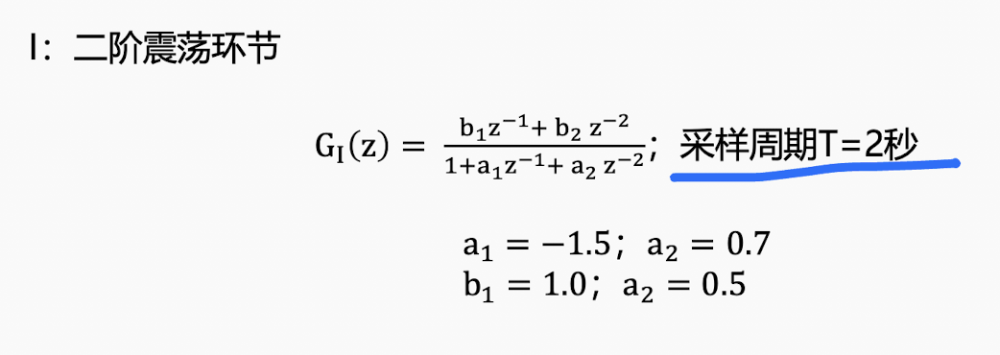
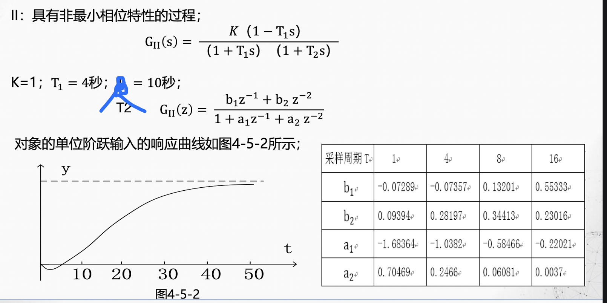
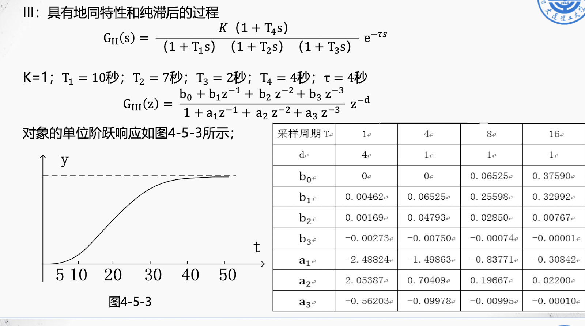
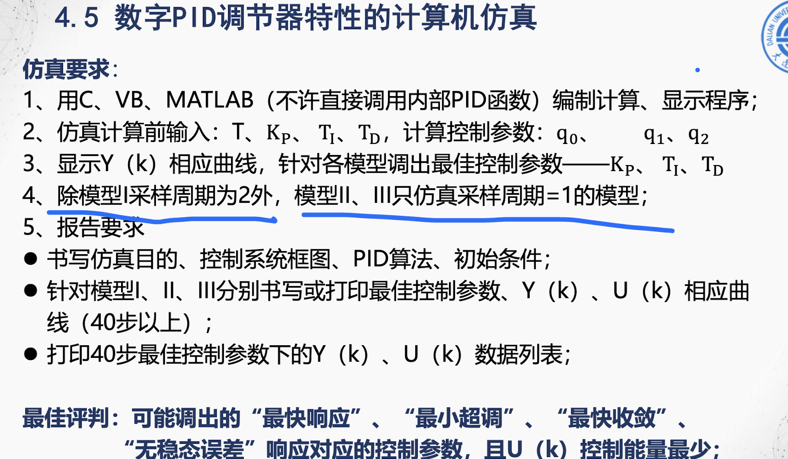

# 基于遗传算法的PID参数最优化

大连理工大学 2020级 自动化 S. Zhu  
《现代智能优化算法》X《计算机控制技术课程设计》  

## 安装

```bash
pip3 install numpy
pip3 install scipy
```

## 背景

源于《计算机控制技术课程设计》。为了实现科学调参、高效调参，也是为了学习一下GA算法，于是花了半天时间写了一个利用GA求PID最优参数的小demo。本人工程水平较弱，如有错误的地方，欢迎各位大佬批评指正。

### 第一题



### 第二题



### 第三题



### 要求



## 运行

运行`ga_pid[123].py`求得最优参数  
运行`pid[123].py`画出响应曲线

## 致谢

感谢某位不知名前辈
